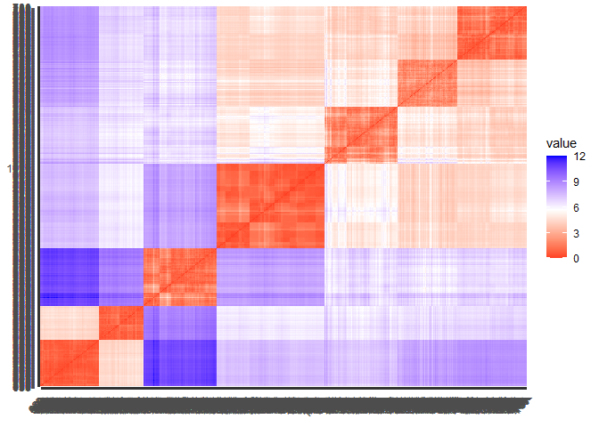
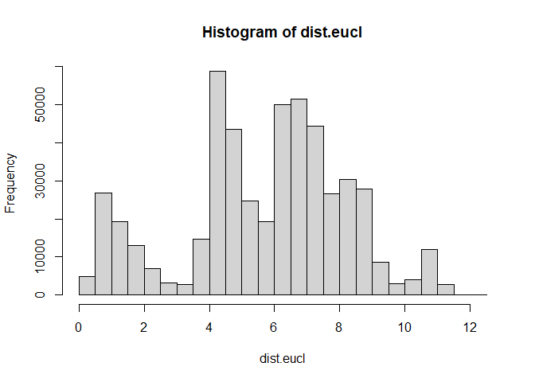
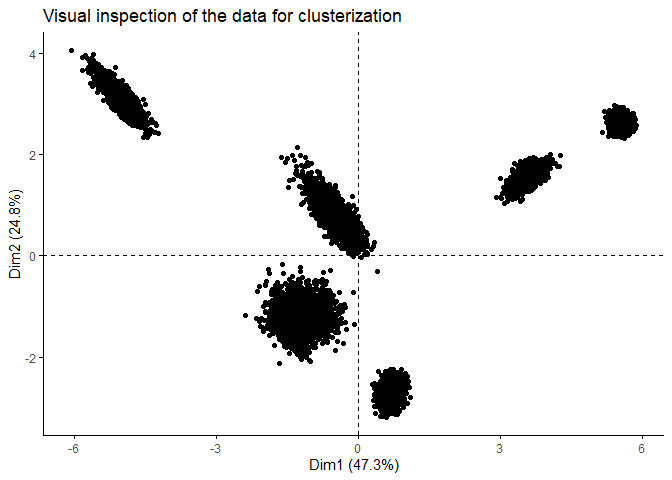
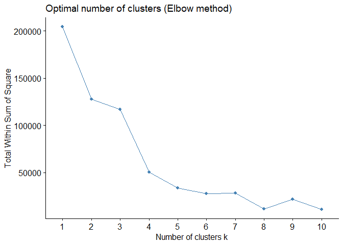
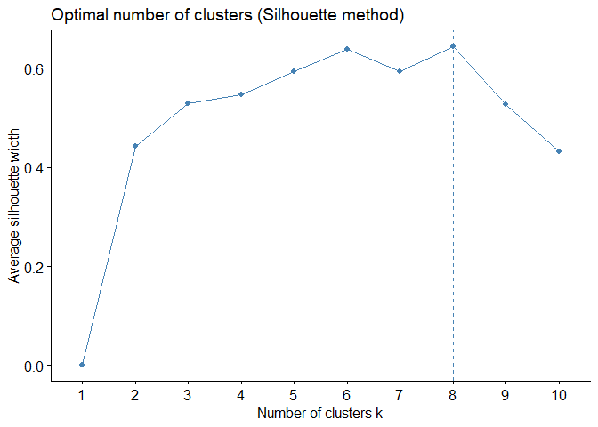
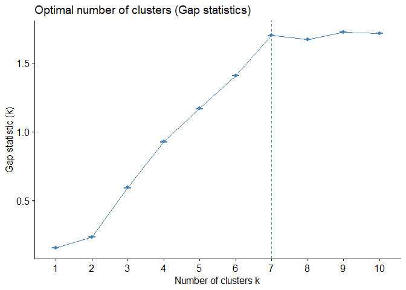
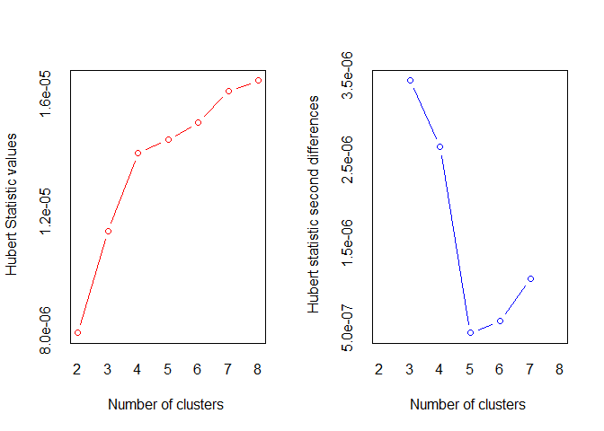
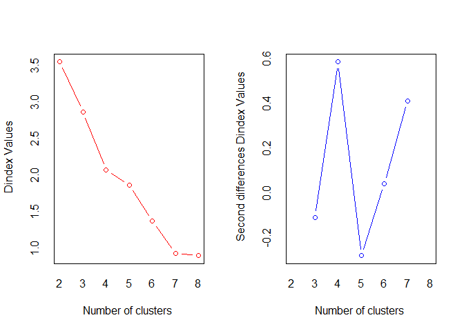
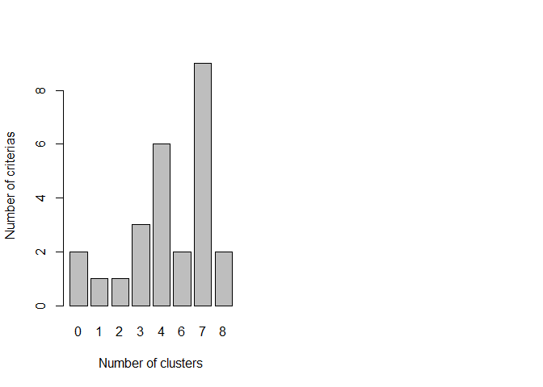

Data Preparation and Clustering Validation
================

# Preparation of dataset and Clustering Validation

``` r
#Load the packages
load(".RData")
packages <- readLines("requirements.txt")
```

    ## Warning in readLines("requirements.txt"): incomplete final line found on
    ## 'requirements.txt'

``` r
lapply(packages, library, character.only = TRUE)
```

    ## 
    ## Attaching package: 'dplyr'

    ## The following objects are masked from 'package:stats':
    ## 
    ##     filter, lag

    ## The following objects are masked from 'package:base':
    ## 
    ##     intersect, setdiff, setequal, union

    ## ── Attaching core tidyverse packages ──────────────────────── tidyverse 2.0.0 ──
    ## ✔ forcats   1.0.0     ✔ readr     2.1.5
    ## ✔ ggplot2   3.5.2     ✔ stringr   1.5.1
    ## ✔ lubridate 1.9.4     ✔ tibble    3.2.1
    ## ✔ purrr     1.0.4     ✔ tidyr     1.3.1
    ## ── Conflicts ────────────────────────────────────────── tidyverse_conflicts() ──
    ## ✖ tidyr::extract()   masks magrittr::extract()
    ## ✖ dplyr::filter()    masks stats::filter()
    ## ✖ dplyr::lag()       masks stats::lag()
    ## ✖ purrr::set_names() masks magrittr::set_names()
    ## ℹ Use the conflicted package (<http://conflicted.r-lib.org/>) to force all conflicts to become errors

    ## Warning: package 'modelsummary' was built under R version 4.5.1

    ## Welcome! Want to learn more? See two factoextra-related books at https://goo.gl/ve3WBa
    ## 
    ## Attaching package: 'fastcluster'
    ## 
    ## The following object is masked from 'package:stats':
    ## 
    ##     hclust

    ## Warning: package 'hopkins' was built under R version 4.5.1

    ## Warning: package 'fpc' was built under R version 4.5.1

    ## Warning: package 'mclust' was built under R version 4.5.1

    ## Package 'mclust' version 6.1.1
    ## Type 'citation("mclust")' for citing this R package in publications.
    ## 
    ## Attaching package: 'mclust'
    ## 
    ## The following object is masked from 'package:purrr':
    ## 
    ##     map

    ## Warning: package 'dbscan' was built under R version 4.5.1

    ## 
    ## Attaching package: 'dbscan'
    ## 
    ## The following object is masked from 'package:fpc':
    ## 
    ##     dbscan
    ## 
    ## The following object is masked from 'package:stats':
    ## 
    ##     as.dendrogram

    ## [[1]]
    ## [1] "magrittr"  "stats"     "graphics"  "grDevices" "utils"     "datasets" 
    ## [7] "methods"   "base"     
    ## 
    ## [[2]]
    ## [1] "dplyr"     "magrittr"  "stats"     "graphics"  "grDevices" "utils"    
    ## [7] "datasets"  "methods"   "base"     
    ## 
    ## [[3]]
    ##  [1] "lubridate" "forcats"   "stringr"   "purrr"     "readr"     "tidyr"    
    ##  [7] "tibble"    "ggplot2"   "tidyverse" "dplyr"     "magrittr"  "stats"    
    ## [13] "graphics"  "grDevices" "utils"     "datasets"  "methods"   "base"     
    ## 
    ## [[4]]
    ##  [1] "lubridate" "forcats"   "stringr"   "purrr"     "readr"     "tidyr"    
    ##  [7] "tibble"    "ggplot2"   "tidyverse" "dplyr"     "magrittr"  "stats"    
    ## [13] "graphics"  "grDevices" "utils"     "datasets"  "methods"   "base"     
    ## 
    ## [[5]]
    ##  [1] "modelsummary" "lubridate"    "forcats"      "stringr"      "purrr"       
    ##  [6] "readr"        "tidyr"        "tibble"       "ggplot2"      "tidyverse"   
    ## [11] "dplyr"        "magrittr"     "stats"        "graphics"     "grDevices"   
    ## [16] "utils"        "datasets"     "methods"      "base"        
    ## 
    ## [[6]]
    ##  [1] "modelsummary" "lubridate"    "forcats"      "stringr"      "purrr"       
    ##  [6] "readr"        "tidyr"        "tibble"       "ggplot2"      "tidyverse"   
    ## [11] "dplyr"        "magrittr"     "stats"        "graphics"     "grDevices"   
    ## [16] "utils"        "datasets"     "methods"      "base"        
    ## 
    ## [[7]]
    ##  [1] "factoextra"   "modelsummary" "lubridate"    "forcats"      "stringr"     
    ##  [6] "purrr"        "readr"        "tidyr"        "tibble"       "ggplot2"     
    ## [11] "tidyverse"    "dplyr"        "magrittr"     "stats"        "graphics"    
    ## [16] "grDevices"    "utils"        "datasets"     "methods"      "base"        
    ## 
    ## [[8]]
    ##  [1] "cluster"      "factoextra"   "modelsummary" "lubridate"    "forcats"     
    ##  [6] "stringr"      "purrr"        "readr"        "tidyr"        "tibble"      
    ## [11] "ggplot2"      "tidyverse"    "dplyr"        "magrittr"     "stats"       
    ## [16] "graphics"     "grDevices"    "utils"        "datasets"     "methods"     
    ## [21] "base"        
    ## 
    ## [[9]]
    ##  [1] "fastcluster"  "cluster"      "factoextra"   "modelsummary" "lubridate"   
    ##  [6] "forcats"      "stringr"      "purrr"        "readr"        "tidyr"       
    ## [11] "tibble"       "ggplot2"      "tidyverse"    "dplyr"        "magrittr"    
    ## [16] "stats"        "graphics"     "grDevices"    "utils"        "datasets"    
    ## [21] "methods"      "base"        
    ## 
    ## [[10]]
    ##  [1] "hopkins"      "fastcluster"  "cluster"      "factoextra"   "modelsummary"
    ##  [6] "lubridate"    "forcats"      "stringr"      "purrr"        "readr"       
    ## [11] "tidyr"        "tibble"       "ggplot2"      "tidyverse"    "dplyr"       
    ## [16] "magrittr"     "stats"        "graphics"     "grDevices"    "utils"       
    ## [21] "datasets"     "methods"      "base"        
    ## 
    ## [[11]]
    ##  [1] "hopkins"      "fastcluster"  "cluster"      "factoextra"   "modelsummary"
    ##  [6] "lubridate"    "forcats"      "stringr"      "purrr"        "readr"       
    ## [11] "tidyr"        "tibble"       "ggplot2"      "tidyverse"    "dplyr"       
    ## [16] "magrittr"     "stats"        "graphics"     "grDevices"    "utils"       
    ## [21] "datasets"     "methods"      "base"        
    ## 
    ## [[12]]
    ##  [1] "NbClust"      "hopkins"      "fastcluster"  "cluster"      "factoextra"  
    ##  [6] "modelsummary" "lubridate"    "forcats"      "stringr"      "purrr"       
    ## [11] "readr"        "tidyr"        "tibble"       "ggplot2"      "tidyverse"   
    ## [16] "dplyr"        "magrittr"     "stats"        "graphics"     "grDevices"   
    ## [21] "utils"        "datasets"     "methods"      "base"        
    ## 
    ## [[13]]
    ##  [1] "fpc"          "NbClust"      "hopkins"      "fastcluster"  "cluster"     
    ##  [6] "factoextra"   "modelsummary" "lubridate"    "forcats"      "stringr"     
    ## [11] "purrr"        "readr"        "tidyr"        "tibble"       "ggplot2"     
    ## [16] "tidyverse"    "dplyr"        "magrittr"     "stats"        "graphics"    
    ## [21] "grDevices"    "utils"        "datasets"     "methods"      "base"        
    ## 
    ## [[14]]
    ##  [1] "mclust"       "fpc"          "NbClust"      "hopkins"      "fastcluster" 
    ##  [6] "cluster"      "factoextra"   "modelsummary" "lubridate"    "forcats"     
    ## [11] "stringr"      "purrr"        "readr"        "tidyr"        "tibble"      
    ## [16] "ggplot2"      "tidyverse"    "dplyr"        "magrittr"     "stats"       
    ## [21] "graphics"     "grDevices"    "utils"        "datasets"     "methods"     
    ## [26] "base"        
    ## 
    ## [[15]]
    ##  [1] "dbscan"       "mclust"       "fpc"          "NbClust"      "hopkins"     
    ##  [6] "fastcluster"  "cluster"      "factoextra"   "modelsummary" "lubridate"   
    ## [11] "forcats"      "stringr"      "purrr"        "readr"        "tidyr"       
    ## [16] "tibble"       "ggplot2"      "tidyverse"    "dplyr"        "magrittr"    
    ## [21] "stats"        "graphics"     "grDevices"    "utils"        "datasets"    
    ## [26] "methods"      "base"

## Behavioural data

As a starting point of the customer segmentation, I will pick out only
the behavioural attributes from the ‘raw’ dataframe. This new dataframe
will be called behavioural_data and all the columns must be scaled.
Considerint, that there are only numeric values in all columns, I need
to transform them with a scaling function. The data will be fit within a
specific range/distribution to improve the performance of the model.

``` r
behavioral_data<-raw %>% data.frame() %>% 
  select(InternetTrafficVolume,
         MortageVolume,
         AccountSpending,
         CreditCardSpending,
         HelpHotlineTime,
         CustomerSince,
         GrocerySpending,
         StockVolume,
         CreditVolume,
         NASDAQInvest,
         USAXSFundInvest,
         BranchVisits,
         AppLogins,
         ATMVisits,
         TimeOnlineBanking,
         ServiceFees,
         SocialMediaInter,
         Bitcoins,
         NFTs)
head(behavioral_data)
```

    ##   InternetTrafficVolume MortageVolume AccountSpending CreditCardSpending
    ## 1                    58        430299        938.2333          1418.4175
    ## 2                    36        378228       1128.0831           693.5162
    ## 3                    57        282232        930.6301          1281.3682
    ## 4                    71        394235       1001.7091          1134.8701
    ## 5                    39        350471       1170.8375          1108.7374
    ## 6                    52        331681        932.0145           941.7249
    ##   HelpHotlineTime CustomerSince GrocerySpending StockVolume CreditVolume
    ## 1        3.215175            36        433.1933    1118.460     809.0458
    ## 2        3.443510            36        594.0010    1391.721     802.6025
    ## 3        2.470172            36        573.8570    1117.443     790.6462
    ## 4        5.904162            36        560.8140    1354.413     780.2905
    ## 5        5.100044            37        309.0191    1037.333     803.9947
    ## 6        6.235357            36        565.4349    1555.779     794.8532
    ##   NASDAQInvest USAXSFundInvest BranchVisits AppLogins ATMVisits
    ## 1     1487.870        475.7493            3        10         9
    ## 2     1504.137        490.2583            4        19         8
    ## 3     1500.006        464.7735            3        14         8
    ## 4     1496.449        488.0418            4        14         8
    ## 5     1500.097        450.3138            3        16         9
    ## 6     1501.496        568.1591            4        13         8
    ##   TimeOnlineBanking ServiceFees SocialMediaInter Bitcoins NFTs
    ## 1          71.54881    41.83293               27   0.0032    2
    ## 2          67.13722    52.16733               25   0.0037    1
    ## 3          58.90037    54.63077               28   0.0136    1
    ## 4          60.96027    41.80699               34   0.0016    1
    ## 5          67.15407    57.13193               34   0.0075    0
    ## 6          56.07705    57.05064               24   0.0030    3

### Data Scaling

``` r
set.seed(123) #Insert the same seed to get the same scaled numerical values
behavioral_data_scaled<-scale(behavioral_data)
head(behavioral_data_scaled)
```

    ##      InternetTrafficVolume MortageVolume AccountSpending CreditCardSpending
    ## [1,]            -0.2889997     1.6471061      -0.3450280          0.8636732
    ## [2,]            -0.9537126     1.2700695      -0.1509407         -0.6818782
    ## [3,]            -0.3192140     0.5749801      -0.3528008          0.5714726
    ## [4,]             0.1037852     1.3859733      -0.2801354          0.2591261
    ## [5,]            -0.8630700     1.0690862      -0.1072321          0.2034089
    ## [6,]            -0.4702851     0.9330313      -0.3513856         -0.1526760
    ##      HelpHotlineTime CustomerSince GrocerySpending StockVolume CreditVolume
    ## [1,]      -0.8632445     0.7723802     -0.34104672  -0.6842514   -0.4354132
    ## [2,]      -0.8427150     0.7723802      0.19341832  -0.5016177   -0.4407973
    ## [3,]      -0.9302276     0.7723802      0.12646708  -0.6849314   -0.4507881
    ## [4,]      -0.6214784     0.7723802      0.08311691  -0.5265523   -0.4594416
    ## [5,]      -0.6937764     0.8184972     -0.75375557  -0.7384732   -0.4396339
    ## [6,]      -0.5917007     0.7723802      0.09847517  -0.3919688   -0.4472727
    ##      NASDAQInvest USAXSFundInvest BranchVisits AppLogins ATMVisits
    ## [1,]   -0.2353360      -0.3417909  -0.28345927 -1.319352  1.751956
    ## [2,]   -0.2240967      -0.3244452   0.02716123 -1.059550  1.321701
    ## [3,]   -0.2269506      -0.3549125  -0.28345927 -1.203885  1.321701
    ## [4,]   -0.2294082      -0.3270950   0.02716123 -1.203885  1.321701
    ## [5,]   -0.2268875      -0.3721992  -0.28345927 -1.146151  1.751956
    ## [6,]   -0.2259212      -0.2313141   0.02716123 -1.232751  1.321701
    ##      TimeOnlineBanking ServiceFees SocialMediaInter   Bitcoins       NFTs
    ## [1,]        -0.7152344  0.02878044        0.4675133 -0.8542812 -0.4895549
    ## [2,]        -0.7897758  0.36121889        0.3502121 -0.8520388 -0.8611631
    ## [3,]        -0.9289516  0.44046295        0.5261639 -0.8076386 -0.8611631
    ## [4,]        -0.8941460  0.02794600        0.8780673 -0.8614570 -0.8611631
    ## [5,]        -0.7894912  0.52092062        0.8780673 -0.8349963 -1.2327713
    ## [6,]        -0.9766564  0.51830595        0.2915616 -0.8551782 -0.1179467

### Distance between objects

``` r
random_subset<-behavioral_data_scaled[sample(nrow(behavioral_data_scaled),1000), ]
dist.eucl<-get_dist(random_subset, method = "euclid")
round(as.matrix(dist.eucl)[1:3,1:3],1)
```

    ##     1   2   3
    ## 1 0.0 4.5 6.8
    ## 2 4.5 0.0 7.4
    ## 3 6.8 7.4 0.0

``` r
fviz_dist(dist.eucl)
```

<!-- -->

``` r
hist(dist.eucl)
```

<!-- -->

``` r
median(dist.eucl)
```

    ## [1] 6.148364

I took a random sample of scaled data, because calculating distance
between objects is heavy process when running locally.

I used the Euclidean distance method to measure and overview the
distribution of a random sample of objects. High values mean high
separation between clusters and low value could mean tight cohesion
inside clusters. The distribution of the colours on the matrix shows
that there are underlying clusters.In order to fully understand those
requirements of clusterisation, I will provide additional metrics and
scores.

## Validation of cluster formation + optimal k number of clusters

This validation is prerequisite before modelling, so we have a basic
idea of what the data looks like when plotted. In simple terms, I will
be looking to find ‘clouds’ on the following chart. If there are obvious
chunks of data points, that means we have good probability to build good
clustering model.

### Visual inspection

``` r
fviz_pca_ind(prcomp(behavioral_data_scaled),
             geom = "point", palette = 'jco',
             ggtheme = theme_classic(),
             title = 'Visual inspection of the data for clusterization')
```

<!-- -->
It becomes clear there are 6 visible groups of data. However, that does
not mean that 6 clusters is the optimal number we want to use for the
modelling. There are other methods, which will provide better
orientation.

### Hopkins’ Test for evenly statistically distributed data

This is a statistical hypothesis test, which defines a Null Hypothesis
that the data is generated by a Poisson process, consequently the data
is evenly distributed. If the value of the Hopkins test is above 0.7 to
1, that means the data has good tendency to be clustered or we can also
say that the data is not random and there is connection between
segments.

``` r
set.seed(123)
hopkins_test<-hopkins(behavioral_data_scaled,m = nrow(behavioral_data_scaled)-1)
print(paste0("Hopkins statistic: ", hopkins_test))
```

    ## [1] "Hopkins statistic: 0.999999999999999"

``` r
h_pval<-hopkins.pval(hopkins_test, n = nrow(behavioral_data_scaled)-1)
print(paste0("p-value for statistical significance: ", h_pval))
```

    ## [1] "p-value for statistical significance: 0"

The data show a high tendency for clustering hopkins_test = 0.99, and
Hopkins statistical significance below 0.05, i.e. it is significant.

### Finding an optimal number of clusters

In this part of the project I will apply 4 different methods when
choosing the optimal number of clusters. The main function we use is
fviz_nbclust from the factoextra package. The most advanced method that
we will use is NbClust() from the NbClust package, which provides the
widest scope of clustering validation results. For all of the methods, I
used kmeans as the algorithm to compare with.

- Elbow method - estimates the compactness of the clusterisation and we
  want it as low as possible
- Average Silhoute method - estimates the homogeneity of every data
  point and how well it fits into its own cluster. We look for the max
  value.
- Gap statistics - iteratively compares the variance of clusters based
  on different k number of clusters. We aim to choose the highest value
  for gap statistics and its respective k-number

``` r
# Elbow method
wss<-fviz_nbclust(behavioral_data_scaled, kmeans, method = "wss") + labs(title = "Optimal number of clusters (Elbow method)")
wss
```

<!-- -->

``` r
# Silhouette method
silh<-fviz_nbclust(behavioral_data_scaled, kmeans, method = "silhouette") +labs(title = "Optimal number of clusters (Silhouette method)")
silh
```

<!-- -->

``` r
# Gap statistics
set.seed(123)
pca_sample<- prcomp(behavioral_data_scaled)
reduced_data<-pca_sample$x[ ,1:3]
gap<-fviz_nbclust(reduced_data, FUNcluster = function(x,k) kmeans(x, centers = k, nstart = 10, iter.max = 100), 
    method = "gap_stat", 
    nboot = 20) + labs(title = "Optimal number of clusters (Gap statistics)")
```

    ## Warning: Quick-TRANSfer stage steps exceeded maximum (= 537500)
    ## Warning: Quick-TRANSfer stage steps exceeded maximum (= 537500)
    ## Warning: Quick-TRANSfer stage steps exceeded maximum (= 537500)
    ## Warning: Quick-TRANSfer stage steps exceeded maximum (= 537500)
    ## Warning: Quick-TRANSfer stage steps exceeded maximum (= 537500)

``` r
gap
```

<!-- -->
NbClust is the most advanced method, which allows me to compare withing
a range of k (2-8).

!Please note that NbClust is heavy function to process locally on
standard PC and it usually takes time!

``` r
nb<-NbClust(data = behavioral_data_scaled, distance = "euclidean", min.nc = 2, max.nc = 8, method = "kmeans") #Pick min and max number of clusters.
```

<!-- -->

    ## *** : The Hubert index is a graphical method of determining the number of clusters.
    ##                 In the plot of Hubert index, we seek a significant knee that corresponds to a 
    ##                 significant increase of the value of the measure i.e the significant peak in Hubert
    ##                 index second differences plot. 
    ## 

<!-- -->

    ## *** : The D index is a graphical method of determining the number of clusters. 
    ##                 In the plot of D index, we seek a significant knee (the significant peak in Dindex
    ##                 second differences plot) that corresponds to a significant increase of the value of
    ##                 the measure. 
    ##  
    ## ******************************************************************* 
    ## * Among all indices:                                                
    ## * 1 proposed 2 as the best number of clusters 
    ## * 3 proposed 3 as the best number of clusters 
    ## * 6 proposed 4 as the best number of clusters 
    ## * 2 proposed 6 as the best number of clusters 
    ## * 9 proposed 7 as the best number of clusters 
    ## * 2 proposed 8 as the best number of clusters 
    ## 
    ##                    ***** Conclusion *****                            
    ##  
    ## * According to the majority rule, the best number of clusters is  7 
    ##  
    ##  
    ## *******************************************************************

``` r
barNbclust<-barplot(table(nb$Best.nc[1,]), xlab ="Number of clusters", ylab = "Number of criterias")
barNbclust
```

    ##      [,1]
    ## [1,]  0.7
    ## [2,]  1.9
    ## [3,]  3.1
    ## [4,]  4.3
    ## [5,]  5.5
    ## [6,]  6.7
    ## [7,]  7.9
    ## [8,]  9.1

<!-- -->
The optimal number of clusters after running NbClust is 7. Also, with 4
clusters, we can read a good evaluation of the validation method.

The conclusion we can draw after validating the number of clusters is
that they vary between 6 and 8. Only the NbClust function shows a good
estimate for 4 segments. It is significant to note that both Elbow and
Silhouette method have a smoothing in the line at around 5 clusters.

## Next: Clustering analysis and choosing the best model

In the next part of the project, I will test out the majority of
clustering models and algorithms. The test will be performed with k
(number of clusters) around 7. Right below every model, I will analyse
the model with validating visualizations and evaluations.
