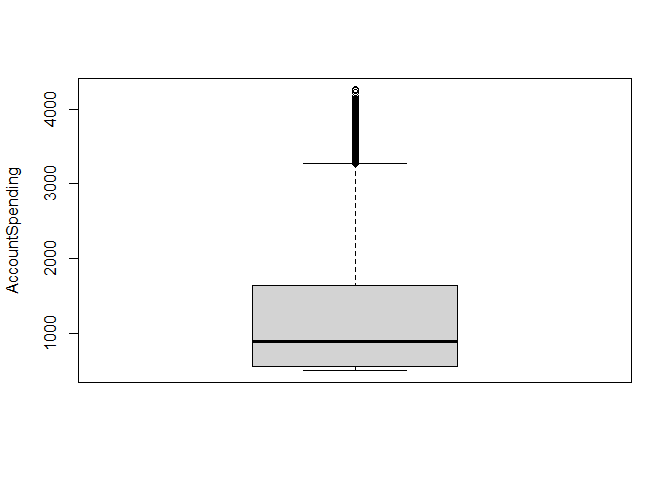

EDA
================

# Explanatory Data Analysis

## Content

1.  Read and inspect data
2.  Check for NULL values
3.  Correlation between variables
4.  Distribution of customers based on age and other attributes
5.  Outliers detection

Load the required packages for the whole project:

``` r
packages <- readLines("requirements.txt")
```

``` r
lapply(packages, library, character.only = TRUE)
```

    ## [[1]]
    ## [1] "magrittr"  "stats"     "graphics"  "grDevices" "utils"     "datasets" 
    ## [7] "methods"   "base"     
    ## 
    ## [[2]]
    ## [1] "dplyr"     "magrittr"  "stats"     "graphics"  "grDevices" "utils"    
    ## [7] "datasets"  "methods"   "base"     
    ## 
    ## [[3]]
    ##  [1] "lubridate" "forcats"   "stringr"   "purrr"     "readr"     "tidyr"    
    ##  [7] "tibble"    "ggplot2"   "tidyverse" "dplyr"     "magrittr"  "stats"    
    ## [13] "graphics"  "grDevices" "utils"     "datasets"  "methods"   "base"     
    ## 
    ## [[4]]
    ##  [1] "lubridate" "forcats"   "stringr"   "purrr"     "readr"     "tidyr"    
    ##  [7] "tibble"    "ggplot2"   "tidyverse" "dplyr"     "magrittr"  "stats"    
    ## [13] "graphics"  "grDevices" "utils"     "datasets"  "methods"   "base"     
    ## 
    ## [[5]]
    ##  [1] "modelsummary" "lubridate"    "forcats"      "stringr"      "purrr"       
    ##  [6] "readr"        "tidyr"        "tibble"       "ggplot2"      "tidyverse"   
    ## [11] "dplyr"        "magrittr"     "stats"        "graphics"     "grDevices"   
    ## [16] "utils"        "datasets"     "methods"      "base"        
    ## 
    ## [[6]]
    ##  [1] "modelsummary" "lubridate"    "forcats"      "stringr"      "purrr"       
    ##  [6] "readr"        "tidyr"        "tibble"       "ggplot2"      "tidyverse"   
    ## [11] "dplyr"        "magrittr"     "stats"        "graphics"     "grDevices"   
    ## [16] "utils"        "datasets"     "methods"      "base"        
    ## 
    ## [[7]]
    ##  [1] "factoextra"   "modelsummary" "lubridate"    "forcats"      "stringr"     
    ##  [6] "purrr"        "readr"        "tidyr"        "tibble"       "ggplot2"     
    ## [11] "tidyverse"    "dplyr"        "magrittr"     "stats"        "graphics"    
    ## [16] "grDevices"    "utils"        "datasets"     "methods"      "base"        
    ## 
    ## [[8]]
    ##  [1] "cluster"      "factoextra"   "modelsummary" "lubridate"    "forcats"     
    ##  [6] "stringr"      "purrr"        "readr"        "tidyr"        "tibble"      
    ## [11] "ggplot2"      "tidyverse"    "dplyr"        "magrittr"     "stats"       
    ## [16] "graphics"     "grDevices"    "utils"        "datasets"     "methods"     
    ## [21] "base"        
    ## 
    ## [[9]]
    ##  [1] "fastcluster"  "cluster"      "factoextra"   "modelsummary" "lubridate"   
    ##  [6] "forcats"      "stringr"      "purrr"        "readr"        "tidyr"       
    ## [11] "tibble"       "ggplot2"      "tidyverse"    "dplyr"        "magrittr"    
    ## [16] "stats"        "graphics"     "grDevices"    "utils"        "datasets"    
    ## [21] "methods"      "base"        
    ## 
    ## [[10]]
    ##  [1] "hopkins"      "fastcluster"  "cluster"      "factoextra"   "modelsummary"
    ##  [6] "lubridate"    "forcats"      "stringr"      "purrr"        "readr"       
    ## [11] "tidyr"        "tibble"       "ggplot2"      "tidyverse"    "dplyr"       
    ## [16] "magrittr"     "stats"        "graphics"     "grDevices"    "utils"       
    ## [21] "datasets"     "methods"      "base"        
    ## 
    ## [[11]]
    ##  [1] "hopkins"      "fastcluster"  "cluster"      "factoextra"   "modelsummary"
    ##  [6] "lubridate"    "forcats"      "stringr"      "purrr"        "readr"       
    ## [11] "tidyr"        "tibble"       "ggplot2"      "tidyverse"    "dplyr"       
    ## [16] "magrittr"     "stats"        "graphics"     "grDevices"    "utils"       
    ## [21] "datasets"     "methods"      "base"        
    ## 
    ## [[12]]
    ##  [1] "NbClust"      "hopkins"      "fastcluster"  "cluster"      "factoextra"  
    ##  [6] "modelsummary" "lubridate"    "forcats"      "stringr"      "purrr"       
    ## [11] "readr"        "tidyr"        "tibble"       "ggplot2"      "tidyverse"   
    ## [16] "dplyr"        "magrittr"     "stats"        "graphics"     "grDevices"   
    ## [21] "utils"        "datasets"     "methods"      "base"        
    ## 
    ## [[13]]
    ##  [1] "fpc"          "NbClust"      "hopkins"      "fastcluster"  "cluster"     
    ##  [6] "factoextra"   "modelsummary" "lubridate"    "forcats"      "stringr"     
    ## [11] "purrr"        "readr"        "tidyr"        "tibble"       "ggplot2"     
    ## [16] "tidyverse"    "dplyr"        "magrittr"     "stats"        "graphics"    
    ## [21] "grDevices"    "utils"        "datasets"     "methods"      "base"        
    ## 
    ## [[14]]
    ##  [1] "mclust"       "fpc"          "NbClust"      "hopkins"      "fastcluster" 
    ##  [6] "cluster"      "factoextra"   "modelsummary" "lubridate"    "forcats"     
    ## [11] "stringr"      "purrr"        "readr"        "tidyr"        "tibble"      
    ## [16] "ggplot2"      "tidyverse"    "dplyr"        "magrittr"     "stats"       
    ## [21] "graphics"     "grDevices"    "utils"        "datasets"     "methods"     
    ## [26] "base"        
    ## 
    ## [[15]]
    ##  [1] "dbscan"       "mclust"       "fpc"          "NbClust"      "hopkins"     
    ##  [6] "fastcluster"  "cluster"      "factoextra"   "modelsummary" "lubridate"   
    ## [11] "forcats"      "stringr"      "purrr"        "readr"        "tidyr"       
    ## [16] "tibble"       "ggplot2"      "tidyverse"    "dplyr"        "magrittr"    
    ## [21] "stats"        "graphics"     "grDevices"    "utils"        "datasets"    
    ## [26] "methods"      "base"        
    ## 
    ## [[16]]
    ##  [1] "knitr"        "dbscan"       "mclust"       "fpc"          "NbClust"     
    ##  [6] "hopkins"      "fastcluster"  "cluster"      "factoextra"   "modelsummary"
    ## [11] "lubridate"    "forcats"      "stringr"      "purrr"        "readr"       
    ## [16] "tidyr"        "tibble"       "ggplot2"      "tidyverse"    "dplyr"       
    ## [21] "magrittr"     "stats"        "graphics"     "grDevices"    "utils"       
    ## [26] "datasets"     "methods"      "base"

## Read and inspect data

``` r
raw<-read.csv(file = "WalletUpCRM.csv")
raw<-data.frame(raw)
head(raw)
```

    ##   Age Income HouseholdSize CityAreaSize MeanCityIncome MeanCityHousePrize
    ## 1  40  79623             2       454686          90668            1849978
    ## 2  37  71616             5       452465         156742            1849599
    ## 3  71  78524             1       456594          52484            1849953
    ## 4  53  69938             3       456594         118422            1849302
    ## 5  40  74244             1       452004          36227            1849247
    ## 6  32  75738             7       456143          91296            1849755
    ##   MeanCityHouseHoldSize MeanCitySqFtPrice NumberCars InternetTrafficVolume
    ## 1                     3              3813          2                    58
    ## 2                     5              5264          2                    36
    ## 3                     3              3405          1                    57
    ## 4                     4              2141          0                    71
    ## 5                     6              2160          1                    39
    ## 6                     3              4686          1                    52
    ##   MortageVolume AccountSpending CreditCardSpending HelpHotlineTime
    ## 1        430299        938.2333          1418.4175        3.215175
    ## 2        378228       1128.0831           693.5162        3.443510
    ## 3        282232        930.6301          1281.3682        2.470172
    ## 4        394235       1001.7091          1134.8701        5.904162
    ## 5        350471       1170.8375          1108.7374        5.100044
    ## 6        331681        932.0145           941.7249        6.235357
    ##   CustomerSince GrocerySpending StockVolume CreditVolume NASDAQInvest
    ## 1            36        433.1933    1118.460     809.0458     1487.870
    ## 2            36        594.0010    1391.721     802.6025     1504.137
    ## 3            36        573.8570    1117.443     790.6462     1500.006
    ## 4            36        560.8140    1354.413     780.2905     1496.449
    ## 5            37        309.0191    1037.333     803.9947     1500.097
    ## 6            36        565.4349    1555.779     794.8532     1501.496
    ##   USAXSFundInvest BranchVisits AppLogins ATMVisits TimeOnlineBanking
    ## 1        475.7493            3        10         9          71.54881
    ## 2        490.2583            4        19         8          67.13722
    ## 3        464.7735            3        14         8          58.90037
    ## 4        488.0418            4        14         8          60.96027
    ## 5        450.3138            3        16         9          67.15407
    ## 6        568.1591            4        13         8          56.07705
    ##   ServiceFees SocialMediaInter Bitcoins NFTs
    ## 1    41.83293               27   0.0032    2
    ## 2    52.16733               25   0.0037    1
    ## 3    54.63077               28   0.0136    1
    ## 4    41.80699               34   0.0016    1
    ## 5    57.13193               34   0.0075    0
    ## 6    57.05064               24   0.0030    3

Reviewing the structure of the data

``` r
dim(raw)
```

    ## [1] 10750    28

The dataset includes data for 10 750 customers and their multiple
characteristics, which we will use for the clusterization.

``` r
str(raw)
```

    ## 'data.frame':    10750 obs. of  28 variables:
    ##  $ Age                  : int  40 37 71 53 40 32 72 29 55 38 ...
    ##  $ Income               : int  79623 71616 78524 69938 74244 75738 74816 72334 77992 73186 ...
    ##  $ HouseholdSize        : int  2 5 1 3 1 7 5 3 2 3 ...
    ##  $ CityAreaSize         : int  454686 452465 456594 456594 452004 456143 463071 456844 455962 456032 ...
    ##  $ MeanCityIncome       : int  90668 156742 52484 118422 36227 91296 106445 43453 156272 46232 ...
    ##  $ MeanCityHousePrize   : int  1849978 1849599 1849953 1849302 1849247 1849755 1849963 1849975 1849634 1849832 ...
    ##  $ MeanCityHouseHoldSize: int  3 5 3 4 6 3 2 6 3 2 ...
    ##  $ MeanCitySqFtPrice    : int  3813 5264 3405 2141 2160 4686 4012 3897 2433 3410 ...
    ##  $ NumberCars           : int  2 2 1 0 1 1 2 3 3 0 ...
    ##  $ InternetTrafficVolume: int  58 36 57 71 39 52 62 41 65 67 ...
    ##  $ MortageVolume        : int  430299 378228 282232 394235 350471 331681 350163 436763 216903 250300 ...
    ##  $ AccountSpending      : num  938 1128 931 1002 1171 ...
    ##  $ CreditCardSpending   : num  1418 694 1281 1135 1109 ...
    ##  $ HelpHotlineTime      : num  3.22 3.44 2.47 5.9 5.1 ...
    ##  $ CustomerSince        : int  36 36 36 36 37 36 37 36 36 36 ...
    ##  $ GrocerySpending      : num  433 594 574 561 309 ...
    ##  $ StockVolume          : num  1118 1392 1117 1354 1037 ...
    ##  $ CreditVolume         : num  809 803 791 780 804 ...
    ##  $ NASDAQInvest         : num  1488 1504 1500 1496 1500 ...
    ##  $ USAXSFundInvest      : num  476 490 465 488 450 ...
    ##  $ BranchVisits         : int  3 4 3 4 3 4 3 3 4 4 ...
    ##  $ AppLogins            : int  10 19 14 14 16 13 11 16 20 8 ...
    ##  $ ATMVisits            : int  9 8 8 8 9 8 9 7 8 7 ...
    ##  $ TimeOnlineBanking    : num  71.5 67.1 58.9 61 67.2 ...
    ##  $ ServiceFees          : num  41.8 52.2 54.6 41.8 57.1 ...
    ##  $ SocialMediaInter     : int  27 25 28 34 34 24 21 32 28 24 ...
    ##  $ Bitcoins             : num  0.0032 0.0037 0.0136 0.0016 0.0075 0.003 0.0076 0.0055 0.0036 0.0026 ...
    ##  $ NFTs                 : int  2 1 1 1 0 3 2 4 3 1 ...

The data is all numeric. Every column is in the right data type. Some
attribbutes like income or mortgage are usually decimal numbers, but for
this project they will be analyzed as integers as we do not have further
specific information

``` r
summary(raw)
```

    ##       Age            Income       HouseholdSize   CityAreaSize   
    ##  Min.   :18.00   Min.   : 35202   Min.   :1.00   Min.   : 61613  
    ##  1st Qu.:23.00   1st Qu.: 42803   1st Qu.:2.00   1st Qu.:121704  
    ##  Median :30.00   Median : 71268   Median :3.00   Median :450100  
    ##  Mean   :35.16   Mean   : 84700   Mean   :2.81   Mean   :372196  
    ##  3rd Qu.:45.00   3rd Qu.:125870   3rd Qu.:4.00   3rd Qu.:459418  
    ##  Max.   :74.00   Max.   :181863   Max.   :8.00   Max.   :708729  
    ##  MeanCityIncome   MeanCityHousePrize MeanCityHouseHoldSize MeanCitySqFtPrice
    ##  Min.   : 35372   Min.   : 125011    Min.   :1.000         Min.   :1871     
    ##  1st Qu.:116253   1st Qu.: 444817    1st Qu.:2.000         1st Qu.:2627     
    ##  Median :140458   Median : 614601    Median :3.000         Median :5778     
    ##  Mean   :163706   Mean   : 942505    Mean   :3.023         Mean   :5318     
    ##  3rd Qu.:235000   3rd Qu.:1849915    3rd Qu.:4.000         3rd Qu.:6741     
    ##  Max.   :286996   Max.   :1850000    Max.   :8.000         Max.   :9886     
    ##    NumberCars    InternetTrafficVolume MortageVolume    AccountSpending 
    ##  Min.   :0.000   Min.   :  6.00        Min.   : 14898   Min.   : 500.0  
    ##  1st Qu.:1.000   1st Qu.: 45.00        1st Qu.:120462   1st Qu.: 560.1  
    ##  Median :1.000   Median : 60.00        Median :232414   Median : 898.0  
    ##  Mean   :1.384   Mean   : 67.57        Mean   :202824   Mean   :1275.7  
    ##  3rd Qu.:2.000   3rd Qu.: 86.00        3rd Qu.:287298   3rd Qu.:1647.6  
    ##  Max.   :4.000   Max.   :118.00        Max.   :605846   Max.   :4257.1  
    ##  CreditCardSpending HelpHotlineTime     CustomerSince   GrocerySpending 
    ##  Min.   : 501.1     Min.   : 0.006058   Min.   : 0.00   Min.   : 150.1  
    ##  1st Qu.: 651.1     1st Qu.: 4.577513   1st Qu.: 3.00   1st Qu.: 293.4  
    ##  Median : 785.7     Median : 8.774480   Median :11.00   Median : 426.5  
    ##  Mean   :1013.3     Mean   :12.816409   Mean   :19.25   Mean   : 535.8  
    ##  3rd Qu.:1451.4     3rd Qu.:16.593896   3rd Qu.:36.00   3rd Qu.: 627.9  
    ##  Max.   :2041.9     Max.   :60.754994   Max.   :74.00   Max.   :1253.5  
    ##   StockVolume    CreditVolume     NASDAQInvest    USAXSFundInvest  
    ##  Min.   : 388   Min.   : 117.3   Min.   : 228.4   Min.   :  69.95  
    ##  1st Qu.:1059   1st Qu.: 161.7   1st Qu.: 401.4   1st Qu.: 149.80  
    ##  Median :1537   Median : 802.7   Median :1498.1   Median : 313.82  
    ##  Mean   :2142   Mean   :1330.1   Mean   :1828.5   Mean   : 761.65  
    ##  3rd Qu.:2505   3rd Qu.:2488.0   3rd Qu.:3056.0   3rd Qu.:1060.23  
    ##  Max.   :5738   Max.   :3532.3   Max.   :4532.4   Max.   :3396.61  
    ##   BranchVisits      AppLogins       ATMVisits      TimeOnlineBanking
    ##  Min.   : 0.000   Min.   :  1.0   Min.   : 0.000   Min.   : 22.77   
    ##  1st Qu.: 2.000   1st Qu.: 18.0   1st Qu.: 3.000   1st Qu.: 69.28   
    ##  Median : 3.000   Median : 64.0   Median : 5.000   Median : 88.26   
    ##  Mean   : 3.913   Mean   : 55.7   Mean   : 4.928   Mean   :113.88   
    ##  3rd Qu.: 5.000   3rd Qu.: 82.0   3rd Qu.: 7.000   3rd Qu.:152.92   
    ##  Max.   :20.000   Max.   :130.0   Max.   :11.000   Max.   :232.21   
    ##   ServiceFees       SocialMediaInter    Bitcoins           NFTs       
    ##  Min.   :  0.1343   Min.   : 0.00    Min.   :0.0000   Min.   : 0.000  
    ##  1st Qu.: 17.8442   1st Qu.: 5.00    1st Qu.:0.0005   1st Qu.: 1.000  
    ##  Median : 27.2386   Median :16.00    Median :0.0998   Median : 3.000  
    ##  Mean   : 40.9382   Mean   :19.03    Mean   :0.1937   Mean   : 3.317  
    ##  3rd Qu.: 50.1652   3rd Qu.:31.00    3rd Qu.:0.4005   3rd Qu.: 4.000  
    ##  Max.   :124.2613   Max.   :60.00    Max.   :0.6014   Max.   :12.000

The above shown code provides general exploratory summary of the raw
dataset. By these general statistics, I can overview the mean values and
the distribution of each column.

## Check for NULL values

``` r
any(is.null(raw))
```

    ## [1] FALSE

Check by each column

``` r
sapply(raw, function(x) any(is.null(x)))
```

    ##                   Age                Income         HouseholdSize 
    ##                 FALSE                 FALSE                 FALSE 
    ##          CityAreaSize        MeanCityIncome    MeanCityHousePrize 
    ##                 FALSE                 FALSE                 FALSE 
    ## MeanCityHouseHoldSize     MeanCitySqFtPrice            NumberCars 
    ##                 FALSE                 FALSE                 FALSE 
    ## InternetTrafficVolume         MortageVolume       AccountSpending 
    ##                 FALSE                 FALSE                 FALSE 
    ##    CreditCardSpending       HelpHotlineTime         CustomerSince 
    ##                 FALSE                 FALSE                 FALSE 
    ##       GrocerySpending           StockVolume          CreditVolume 
    ##                 FALSE                 FALSE                 FALSE 
    ##          NASDAQInvest       USAXSFundInvest          BranchVisits 
    ##                 FALSE                 FALSE                 FALSE 
    ##             AppLogins             ATMVisits     TimeOnlineBanking 
    ##                 FALSE                 FALSE                 FALSE 
    ##           ServiceFees      SocialMediaInter              Bitcoins 
    ##                 FALSE                 FALSE                 FALSE 
    ##                  NFTs 
    ##                 FALSE

There are no missing values in the dataset, which assists in quicker
EDA, clustering validation and modelling in the next steps.

\##Correlation analysis

``` r
datasummary_correlation(raw, fmt = 2, title = "Correlation Matrix")
```

|  | Age | Income | HouseholdSize | CityAreaSize | MeanCityIncome | MeanCityHousePrize | MeanCityHouseHoldSize | MeanCitySqFtPrice | NumberCars | InternetTrafficVolume | MortageVolume | AccountSpending | CreditCardSpending | HelpHotlineTime | CustomerSince | GrocerySpending | StockVolume | CreditVolume | NASDAQInvest | USAXSFundInvest | BranchVisits | AppLogins | ATMVisits | TimeOnlineBanking | ServiceFees | SocialMediaInter | Bitcoins | NFTs |
|----|----|----|----|----|----|----|----|----|----|----|----|----|----|----|----|----|----|----|----|----|----|----|----|----|----|----|----|----|
| Age | 1 | . | . | . | . | . | . | . | . | . | . | . | . | . | . | . | . | . | . | . | . | . | . | . | . | . | . | . |
| Income | .66 | 1 | . | . | . | . | . | . | . | . | . | . | . | . | . | . | . | . | . | . | . | . | . | . | . | . | . | . |
| HouseholdSize | .28 | .15 | 1 | . | . | . | . | . | . | . | . | . | . | . | . | . | . | . | . | . | . | . | . | . | . | . | . | . |
| CityAreaSize | -.26 | -.59 | .10 | 1 | . | . | . | . | . | . | . | . | . | . | . | . | . | . | . | . | . | . | . | . | . | . | . | . |
| MeanCityIncome | -.34 | -.49 | -.08 | .66 | 1 | . | . | . | . | . | . | . | . | . | . | . | . | . | . | . | . | . | . | . | . | . | . | . |
| MeanCityHousePrize | -.13 | -.35 | .17 | .73 | .43 | 1 | . | . | . | . | . | . | . | . | . | . | . | . | . | . | . | . | . | . | . | . | . | . |
| MeanCityHouseHoldSize | .24 | .07 | .20 | .08 | -.20 | .14 | 1 | . | . | . | . | . | . | . | . | . | . | . | . | . | . | . | . | . | . | . | . | . |
| MeanCitySqFtPrice | -.10 | -.02 | .05 | .58 | .73 | .56 | -.10 | 1 | . | . | . | . | . | . | . | . | . | . | . | . | . | . | . | . | . | . | . | . |
| NumberCars | .48 | .57 | .19 | -.42 | -.42 | -.10 | .18 | -.12 | 1 | . | . | . | . | . | . | . | . | . | . | . | . | . | . | . | . | . | . | . |
| InternetTrafficVolume | -.31 | -.59 | -.08 | .67 | .45 | .05 | -.05 | .12 | -.60 | 1 | . | . | . | . | . | . | . | . | . | . | . | . | . | . | . | . | . | . |
| MortageVolume | .16 | .35 | -.10 | -.53 | -.66 | -.31 | -.04 | -.58 | .11 | -.26 | 1 | . | . | . | . | . | . | . | . | . | . | . | . | . | . | . | . | . |
| AccountSpending | .73 | .93 | .22 | -.52 | -.40 | -.30 | .15 | .04 | .64 | -.61 | .10 | 1 | . | . | . | . | . | . | . | . | . | . | . | . | . | . | . | . |
| CreditCardSpending | .45 | .54 | .08 | -.75 | -.41 | -.33 | .07 | -.26 | .59 | -.83 | .09 | .66 | 1 | . | . | . | . | . | . | . | . | . | . | . | . | . | . | . |
| HelpHotlineTime | .47 | .77 | .05 | -.69 | -.32 | -.49 | -.03 | -.04 | .50 | -.62 | .10 | .80 | .72 | 1 | . | . | . | . | . | . | . | . | . | . | . | . | . | . |
| CustomerSince | .80 | .81 | .30 | -.43 | -.45 | -.01 | .25 | -.03 | .68 | -.70 | .18 | .89 | .70 | .64 | 1 | . | . | . | . | . | . | . | . | . | . | . | . | . |
| GrocerySpending | .76 | .90 | .22 | -.55 | -.45 | -.39 | .17 | -.07 | .62 | -.55 | .11 | .96 | .66 | .79 | .87 | 1 | . | . | . | . | . | . | . | . | . | . | . | . |
| StockVolume | .33 | .29 | -.09 | -.17 | -.04 | -.62 | -.13 | -.17 | -.15 | .41 | .27 | .19 | -.17 | .19 | -.01 | .27 | 1 | . | . | . | . | . | . | . | . | . | . | . |
| CreditVolume | -.26 | -.52 | -.07 | .80 | .80 | .32 | -.14 | .55 | -.57 | .82 | -.46 | -.51 | -.74 | -.52 | -.57 | -.51 | .33 | 1 | . | . | . | . | . | . | . | . | . | . |
| NASDAQInvest | .61 | .45 | .07 | -.13 | -.09 | -.49 | .03 | -.11 | .05 | .28 | .17 | .43 | -.01 | .29 | .29 | .51 | .92 | .25 | 1 | . | . | . | . | . | . | . | . | . |
| USAXSFundInvest | -.03 | -.31 | -.05 | -.14 | -.27 | -.60 | .09 | -.68 | -.17 | .45 | .03 | -.25 | -.09 | -.16 | -.33 | -.10 | .40 | .01 | .33 | 1 | . | . | . | . | . | . | . | . |
| BranchVisits | .45 | .75 | .11 | -.55 | -.32 | -.19 | .04 | .07 | .55 | -.71 | .12 | .77 | .67 | .71 | .71 | .72 | -.06 | -.56 | .09 | -.39 | 1 | . | . | . | . | . | . | . |
| AppLogins | -.36 | -.31 | -.19 | .39 | .36 | -.25 | -.21 | .15 | -.56 | .83 | -.09 | -.42 | -.76 | -.36 | -.69 | -.40 | .59 | .71 | .37 | .34 | -.51 | 1 | . | . | . | . | . | . |
| ATMVisits | .10 | -.44 | .24 | .53 | .14 | .56 | .32 | .01 | -.02 | .20 | -.34 | -.26 | -.13 | -.44 | .02 | -.22 | -.37 | .17 | -.17 | .15 | -.31 | -.26 | 1 | . | . | . | . | . |
| TimeOnlineBanking | -.29 | -.26 | -.27 | .03 | .06 | -.54 | -.24 | -.27 | -.51 | .70 | .26 | -.43 | -.56 | -.27 | -.64 | -.35 | .73 | .45 | .45 | .57 | -.49 | .87 | -.35 | 1 | . | . | . | . |
| ServiceFees | .37 | .04 | .01 | .18 | .23 | -.30 | -.03 | .01 | -.21 | .56 | -.04 | .05 | -.26 | -.01 | -.04 | .14 | .86 | .57 | .88 | .39 | -.22 | .53 | .01 | .55 | 1 | . | . | . |
| SocialMediaInter | .09 | -.33 | -.03 | .48 | .32 | -.00 | -.03 | .00 | -.44 | .78 | .02 | -.37 | -.60 | -.44 | -.34 | -.29 | .67 | .74 | .62 | .38 | -.54 | .63 | .20 | .64 | .82 | 1 | . | . |
| Bitcoins | -.03 | .02 | -.08 | .14 | -.06 | -.47 | -.06 | -.15 | -.32 | .69 | .16 | -.10 | -.59 | -.16 | -.37 | -.04 | .75 | .40 | .61 | .51 | -.34 | .86 | -.27 | .85 | .59 | .60 | 1 | . |
| NFTs | -.01 | -.20 | -.09 | .37 | .31 | -.23 | -.12 | .07 | -.45 | .80 | -.03 | -.27 | -.63 | -.29 | -.43 | -.21 | .76 | .72 | .65 | .40 | -.46 | .83 | -.08 | .79 | .79 | .83 | .80 | 1 |

Correlation Matrix

There is a strong positive correlation between Grocery Spending x Income
(0.9). Logically, a strong positive correlation with a coefficient of
0.92 can also be observed between Stock Volume x NasdaqInvest.
Investments made in Bitcoin and NFT are correlated with a coefficient of
0.8, which may indicate that similar types of financial assets are
preferred by one type of customer. However, strong or weak correlation
coefficients do not equal causation between the analysed
characteristics. This is another reason why we want to build the
clustering model based on only behavioral attributes and ignore
demographics like age and income. The customers’ behaviour can hide
interesting insights or segments, which can not be observed with simple
EDA or correlation analysis.

## Distribution of customers based on age and other attributes

In the following code chunk, I built multiple visualizations in order to
compare customers once they are divided in age groups. First I had to
create the age bins, after that I inserted 4 bar charts.

``` r
data_age_bins <- raw %>%
  mutate(age_group = case_when(
    Age <= 26 ~ "18-26",
    Age <= 34 ~ "26-34",
    Age <= 41 ~ "33-41",
    Age <= 49 ~ "41-49",
    Age <= 56 ~ "48-56",
    Age <= 63 ~ "56-63",
    Age >= 64 ~ "Over 64"
  ))
head(data_age_bins$age_group)
```

    ## [1] "33-41"   "33-41"   "Over 64" "48-56"   "33-41"   "26-34"

``` r
# Count of people in each age bin.
ggplot(data_age_bins, aes(x = age_group)) +
  geom_bar(fill = "skyblue", color = "darkblue") +
  theme_minimal() +
  labs(title = "Distribution of Age Groups", x = "Age Group", y = "Count")
```

<!-- -->

``` r
# We have the most customers in the youngest age group, 18-25, with nearly 4,000 people. Then there are those aged 56-63 with about 1,600. And the fewest are pensioners over 64.

# Age Group x Income
ggplot(data_age_bins, aes(x = age_group, y=Income)) +
  geom_col(fill = "skyblue", color = "darkblue") +
  theme_minimal() +
  labs(title = "Distribution of Income", x = "Age Group", y = "Income") +
  scale_y_continuous(labels = function(x) format(round(x), big.mark = ",", scientific = FALSE))
```

<!-- -->

``` r
# The two groups 26 - 34 and 56 - 63 have the highest income, exceeding $200,000. People in the middle age group from 40 to 55 years old, as well as retirees, have lower incomes.

# Age Group x Mortgage Volume
ggplot(data_age_bins, aes(x = age_group, y= MortageVolume)) +
  geom_col(fill = "skyblue", color = "darkblue") +
  theme_minimal() +
  labs(title = "Distribution of Mortgage", x = "Age Group", y = "Mortgage")+
  scale_y_continuous(labels = function(x) format(round(x), big.mark = ",", scientific = FALSE))
```

<!-- -->

``` r
# Young adults between 26 and 34 have the highest mortgage debt at over $800,000,000 in total value.

# Age Group x ATM Transactions
ggplot(data_age_bins, aes(x = age_group, y= ATMVisits)) +
  geom_col(fill = "skyblue", color = "darkblue") +
  theme_minimal() +
  labs(title = "Distribution of ATM Visits", x = "Age Group", y = "ATM Visits")+
  scale_y_continuous(labels = function(x) format(round(x), big.mark = ",", scientific = FALSE))
```

<!-- -->

From this last graph, we can conclude that young customers most often
use ATMs to withdraw cash.

## Outliers detection

Even though I work with clean dataset, it is still very important to
check for outliers in the data. These are too high or low values based
on the interquartile range of the attribute. I picked the reviewed
attributes on random choice. The detection of outliers is crucial,
because if there are identified ones, eventually the final ML clustering
model should be picked with such consideration. I used boxplots to
quickly review.

``` r
boxplot(raw$MortageVolume, ylab = "Mortgage")
```

<!-- -->

``` r
boxplot(raw$AccountSpending, ylab= "AccountSpending")
```

<!-- -->

``` r
boxplot(raw$GrocerySpending, ylab= "GrocerySpending")
```

<!-- -->

``` r
boxplot(raw$USAXSFundInvest, ylab= "USAXS Fund Invest")
```

<!-- -->

``` r
boxplot(raw$ServiceFees, ylab= "ServiceFees")
```

<!-- -->

In the dataset containing the behavioral characteristics of customers,
anomalies can be found in some variables. If this data is not removed,
but kept in order to preserve the information, then it is good to choose
a clustering model, which copes better with the treatment of anomalies.
For example, k-means is quite sensitive to outliers and it is possible
that K-medoids is more suitable.

In the next notebooks, the project will continue in preparing the data
for model building, validation of cluster formation and optimal number
of k-clusters. Once I find this information, the testing between
different models can initiate. Each model will be valuated with specific
metrics. In the end, we will analyze the clustered dataset and present
the customer segments.
