Interpretation, analysis and segmentation
================

# Analysing results and customer segments

# Content

1.  Clustering model
2.  Interpretation of the clusters
3.  Analysis of the customers in each cluster
4.  Personas
5.  Conclusion

``` r
load(".RData")
packages <- readLines("requirements.txt")
```

``` r
lapply(packages, library, character.only = TRUE)
```

    ## [[1]]
    ## [1] "magrittr"  "stats"     "graphics"  "grDevices" "utils"     "datasets" 
    ## [7] "methods"   "base"     
    ## 
    ## [[2]]
    ## [1] "dplyr"     "magrittr"  "stats"     "graphics"  "grDevices" "utils"    
    ## [7] "datasets"  "methods"   "base"     
    ## 
    ## [[3]]
    ##  [1] "lubridate" "forcats"   "stringr"   "purrr"     "readr"     "tidyr"    
    ##  [7] "tibble"    "ggplot2"   "tidyverse" "dplyr"     "magrittr"  "stats"    
    ## [13] "graphics"  "grDevices" "utils"     "datasets"  "methods"   "base"     
    ## 
    ## [[4]]
    ##  [1] "lubridate" "forcats"   "stringr"   "purrr"     "readr"     "tidyr"    
    ##  [7] "tibble"    "ggplot2"   "tidyverse" "dplyr"     "magrittr"  "stats"    
    ## [13] "graphics"  "grDevices" "utils"     "datasets"  "methods"   "base"     
    ## 
    ## [[5]]
    ##  [1] "modelsummary" "lubridate"    "forcats"      "stringr"      "purrr"       
    ##  [6] "readr"        "tidyr"        "tibble"       "ggplot2"      "tidyverse"   
    ## [11] "dplyr"        "magrittr"     "stats"        "graphics"     "grDevices"   
    ## [16] "utils"        "datasets"     "methods"      "base"        
    ## 
    ## [[6]]
    ##  [1] "modelsummary" "lubridate"    "forcats"      "stringr"      "purrr"       
    ##  [6] "readr"        "tidyr"        "tibble"       "ggplot2"      "tidyverse"   
    ## [11] "dplyr"        "magrittr"     "stats"        "graphics"     "grDevices"   
    ## [16] "utils"        "datasets"     "methods"      "base"        
    ## 
    ## [[7]]
    ##  [1] "factoextra"   "modelsummary" "lubridate"    "forcats"      "stringr"     
    ##  [6] "purrr"        "readr"        "tidyr"        "tibble"       "ggplot2"     
    ## [11] "tidyverse"    "dplyr"        "magrittr"     "stats"        "graphics"    
    ## [16] "grDevices"    "utils"        "datasets"     "methods"      "base"        
    ## 
    ## [[8]]
    ##  [1] "cluster"      "factoextra"   "modelsummary" "lubridate"    "forcats"     
    ##  [6] "stringr"      "purrr"        "readr"        "tidyr"        "tibble"      
    ## [11] "ggplot2"      "tidyverse"    "dplyr"        "magrittr"     "stats"       
    ## [16] "graphics"     "grDevices"    "utils"        "datasets"     "methods"     
    ## [21] "base"        
    ## 
    ## [[9]]
    ##  [1] "fastcluster"  "cluster"      "factoextra"   "modelsummary" "lubridate"   
    ##  [6] "forcats"      "stringr"      "purrr"        "readr"        "tidyr"       
    ## [11] "tibble"       "ggplot2"      "tidyverse"    "dplyr"        "magrittr"    
    ## [16] "stats"        "graphics"     "grDevices"    "utils"        "datasets"    
    ## [21] "methods"      "base"        
    ## 
    ## [[10]]
    ##  [1] "hopkins"      "fastcluster"  "cluster"      "factoextra"   "modelsummary"
    ##  [6] "lubridate"    "forcats"      "stringr"      "purrr"        "readr"       
    ## [11] "tidyr"        "tibble"       "ggplot2"      "tidyverse"    "dplyr"       
    ## [16] "magrittr"     "stats"        "graphics"     "grDevices"    "utils"       
    ## [21] "datasets"     "methods"      "base"        
    ## 
    ## [[11]]
    ##  [1] "hopkins"      "fastcluster"  "cluster"      "factoextra"   "modelsummary"
    ##  [6] "lubridate"    "forcats"      "stringr"      "purrr"        "readr"       
    ## [11] "tidyr"        "tibble"       "ggplot2"      "tidyverse"    "dplyr"       
    ## [16] "magrittr"     "stats"        "graphics"     "grDevices"    "utils"       
    ## [21] "datasets"     "methods"      "base"        
    ## 
    ## [[12]]
    ##  [1] "NbClust"      "hopkins"      "fastcluster"  "cluster"      "factoextra"  
    ##  [6] "modelsummary" "lubridate"    "forcats"      "stringr"      "purrr"       
    ## [11] "readr"        "tidyr"        "tibble"       "ggplot2"      "tidyverse"   
    ## [16] "dplyr"        "magrittr"     "stats"        "graphics"     "grDevices"   
    ## [21] "utils"        "datasets"     "methods"      "base"        
    ## 
    ## [[13]]
    ##  [1] "fpc"          "NbClust"      "hopkins"      "fastcluster"  "cluster"     
    ##  [6] "factoextra"   "modelsummary" "lubridate"    "forcats"      "stringr"     
    ## [11] "purrr"        "readr"        "tidyr"        "tibble"       "ggplot2"     
    ## [16] "tidyverse"    "dplyr"        "magrittr"     "stats"        "graphics"    
    ## [21] "grDevices"    "utils"        "datasets"     "methods"      "base"        
    ## 
    ## [[14]]
    ##  [1] "mclust"       "fpc"          "NbClust"      "hopkins"      "fastcluster" 
    ##  [6] "cluster"      "factoextra"   "modelsummary" "lubridate"    "forcats"     
    ## [11] "stringr"      "purrr"        "readr"        "tidyr"        "tibble"      
    ## [16] "ggplot2"      "tidyverse"    "dplyr"        "magrittr"     "stats"       
    ## [21] "graphics"     "grDevices"    "utils"        "datasets"     "methods"     
    ## [26] "base"        
    ## 
    ## [[15]]
    ##  [1] "dbscan"       "mclust"       "fpc"          "NbClust"      "hopkins"     
    ##  [6] "fastcluster"  "cluster"      "factoextra"   "modelsummary" "lubridate"   
    ## [11] "forcats"      "stringr"      "purrr"        "readr"        "tidyr"       
    ## [16] "tibble"       "ggplot2"      "tidyverse"    "dplyr"        "magrittr"    
    ## [21] "stats"        "graphics"     "grDevices"    "utils"        "datasets"    
    ## [26] "methods"      "base"        
    ## 
    ## [[16]]
    ##  [1] "knitr"        "dbscan"       "mclust"       "fpc"          "NbClust"     
    ##  [6] "hopkins"      "fastcluster"  "cluster"      "factoextra"   "modelsummary"
    ## [11] "lubridate"    "forcats"      "stringr"      "purrr"        "readr"       
    ## [16] "tidyr"        "tibble"       "ggplot2"      "tidyverse"    "dplyr"       
    ## [21] "magrittr"     "stats"        "graphics"     "grDevices"    "utils"       
    ## [26] "datasets"     "methods"      "base"

# Clustering algorithm

The model that I chose to describe the customer segmentation is CLARA
with 6 clusters. This decision was taken after careful analysis and
comparison between other clustering algorithms.

## Visualization of the clusters

``` r
fviz_cluster(clara_res1,
             data=scaled_behav,
             ellipse.type = "euclid",
             repel = FALSE,
             ggtheme = theme_classic(),
             palette = 'jco',
             main = "CLARA 6 CLUSTERS")
```

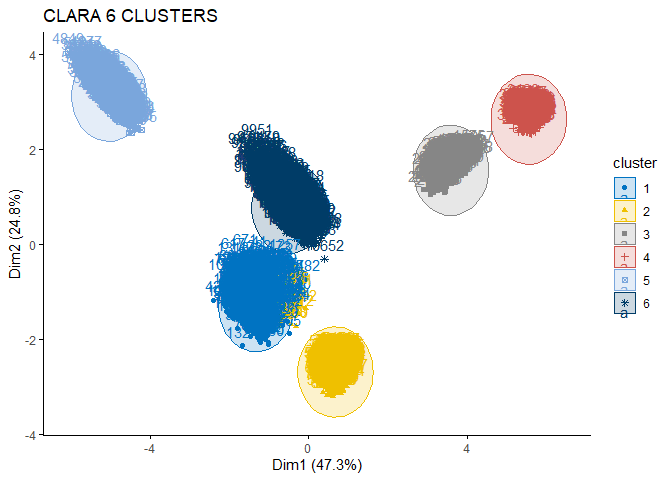<!-- -->

<!-- -->
**The first step is to add the ‘cluster’ column’, which describes the
cluster affiliations of each data object.**

``` r
clust_data <- cbind(data, clara_res1$clustering)
colnames(clust_data)[ncol(clust_data)]<-"Clusters" #Last column
head(clust_data)
```

    ##   Age Income HouseholdSize CityAreaSize MeanCityIncome MeanCityHousePrize
    ## 1  40  79623             2       454686          90668            1849978
    ## 2  37  71616             5       452465         156742            1849599
    ## 3  71  78524             1       456594          52484            1849953
    ## 4  53  69938             3       456594         118422            1849302
    ## 5  40  74244             1       452004          36227            1849247
    ## 6  32  75738             7       456143          91296            1849755
    ##   MeanCityHouseHoldSize MeanCitySqFtPrice NumberCars InternetTrafficVolume
    ## 1                     3              3813          2                    58
    ## 2                     5              5264          2                    36
    ## 3                     3              3405          1                    57
    ## 4                     4              2141          0                    71
    ## 5                     6              2160          1                    39
    ## 6                     3              4686          1                    52
    ##   MortageVolume AccountSpending CreditCardSpending HelpHotlineTime
    ## 1        430299        938.2333          1418.4175        3.215175
    ## 2        378228       1128.0831           693.5162        3.443510
    ## 3        282232        930.6301          1281.3682        2.470172
    ## 4        394235       1001.7091          1134.8701        5.904162
    ## 5        350471       1170.8375          1108.7374        5.100044
    ## 6        331681        932.0145           941.7249        6.235357
    ##   CustomerSince GrocerySpending StockVolume CreditVolume NASDAQInvest
    ## 1            36        433.1933    1118.460     809.0458     1487.870
    ## 2            36        594.0010    1391.721     802.6025     1504.137
    ## 3            36        573.8570    1117.443     790.6462     1500.006
    ## 4            36        560.8140    1354.413     780.2905     1496.449
    ## 5            37        309.0191    1037.333     803.9947     1500.097
    ## 6            36        565.4349    1555.779     794.8532     1501.496
    ##   USAXSFundInvest BranchVisits AppLogins ATMVisits TimeOnlineBanking
    ## 1        475.7493            3        10         9          71.54881
    ## 2        490.2583            4        19         8          67.13722
    ## 3        464.7735            3        14         8          58.90037
    ## 4        488.0418            4        14         8          60.96027
    ## 5        450.3138            3        16         9          67.15407
    ## 6        568.1591            4        13         8          56.07705
    ##   ServiceFees SocialMediaInter Bitcoins NFTs Clusters
    ## 1    41.83293               27   0.0032    2        1
    ## 2    52.16733               25   0.0037    1        1
    ## 3    54.63077               28   0.0136    1        1
    ## 4    41.80699               34   0.0016    1        1
    ## 5    57.13193               34   0.0075    0        1
    ## 6    57.05064               24   0.0030    3        1

## Number of objects in each cluster

``` r
clust_data %>%
  group_by(Clusters) %>%
  summarise(count = n())
```

    ## # A tibble: 6 × 2
    ##   Clusters count
    ##      <int> <int>
    ## 1        1  2959
    ## 2        2  2541
    ## 3        3  1000
    ## 4        4  1250
    ## 5        5  1500
    ## 6        6  1500

# Interpretation of the clusters

Descriptive statistics for each feature relative to cluster membership.
Examination of arithmetic mean, maximum, and minimum.

``` r
clust_summary <- clust_data %>%
  group_by(Clusters) %>%
  summarise(across(where(is.numeric),
                   list(mean = mean, min = min, max = max),
                   .names = "{.col}_{.fn}")) %>% ungroup()

clust_summary
```

    ## # A tibble: 6 × 85
    ##   Clusters Age_mean Age_min Age_max Income_mean Income_min Income_max
    ##      <int>    <dbl>   <int>   <int>       <dbl>      <int>      <int>
    ## 1        1     33.3      19      74      59856.      39118      91756
    ## 2        2     23.5      18      69      38587.      35202      84833
    ## 3        3     41.9      18      73      67991.      66355      69973
    ## 4        4     37.4      26      49      74948.      69665      80953
    ## 5        5     58.0      55      61     180029.     178605     181863
    ## 6        6     29.4      25      32     135757.      99594     176037
    ## # ℹ 78 more variables: HouseholdSize_mean <dbl>, HouseholdSize_min <int>,
    ## #   HouseholdSize_max <int>, CityAreaSize_mean <dbl>, CityAreaSize_min <int>,
    ## #   CityAreaSize_max <int>, MeanCityIncome_mean <dbl>,
    ## #   MeanCityIncome_min <int>, MeanCityIncome_max <int>,
    ## #   MeanCityHousePrize_mean <dbl>, MeanCityHousePrize_min <int>,
    ## #   MeanCityHousePrize_max <int>, MeanCityHouseHoldSize_mean <dbl>,
    ## #   MeanCityHouseHoldSize_min <int>, MeanCityHouseHoldSize_max <int>, …

First, I will look at several indicators related to customer behavior at
the bank. I want to look at some basic ones such as mortgages, monthly
expenses, loan amounts, and stock investments.

I will also look at indicators such as the number of logins to the app,
time spent online in the system, Bitcoins, NFTs, and the number of
social media channels related to the fintech industry and new virtual
currencies. I believe that the indicators for these signs would be
higher for customers who would be interested in a service such as
WalletUp. WalletUp’s main focus is on online banking services, which
would primarily interest customers who spend time online and are
interested in modern solutions in the financial industry.

\#Analysis of the customers in each cluster \## Analysis of mean values
for the main financial behavioral factors \### Mortgage

``` r
ggplot(data = clust_summary, aes(x = factor(Clusters), y = clust_summary$MortageVolume_mean)) +
  geom_bar(stat = "identity") +
  scale_y_continuous(labels = scales::comma)+
  labs(x = "Cluster", y = "Mean Mortgage Volume") +
  ggtitle("Mean Mortgage Volume by Cluster")+
  theme_minimal()
```

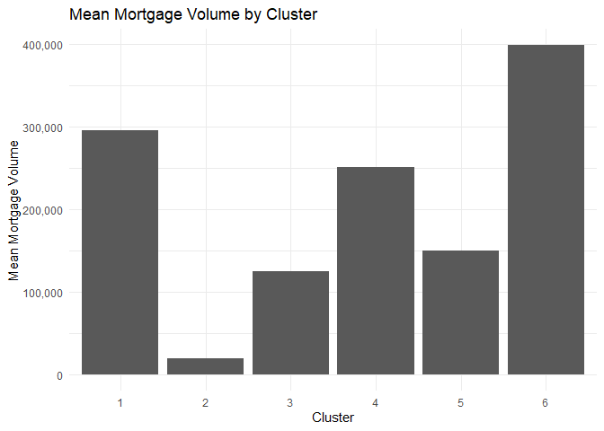<!-- -->

\###Account Spending

``` r
ggplot(data = clust_summary, aes(x = factor(Clusters), y = clust_summary$AccountSpending_mean)) +
  geom_bar(stat = "identity") +
  scale_y_continuous(labels = scales::comma)+
  labs(x = "Cluster", y = "Mean Account Expenditures") +
  ggtitle("Mean Monthly Expenditures by Cluster")+
  theme_minimal()
```

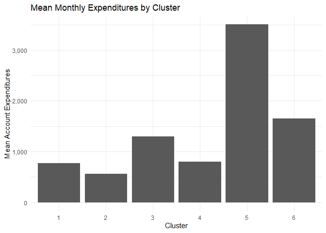<!-- -->

### Credit Volume

``` r
ggplot(data = clust_summary, aes(x = factor(Clusters), y = clust_summary$CreditVolume_mean)) +
  geom_bar(stat = "identity") +
  scale_y_continuous(labels = scales::comma)+
  labs(x = "Cluster", y = "Mean Credit Volume") +
  ggtitle("Mean Credit Volume Cluster")+
  theme_minimal()
```

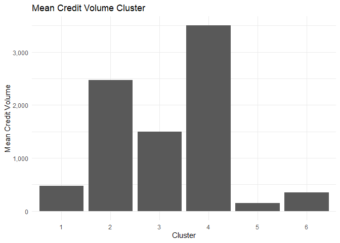<!-- -->

### Stock Volume

``` r
ggplot(data = clust_summary, aes(x = factor(Clusters), y = clust_summary$StockVolume_mean)) +
  geom_bar(stat = "identity") +
  scale_y_continuous(labels = scales::comma)+
  labs(x = "Cluster", y = "Mean Investments in Stocks") +
  ggtitle("Mean Stocks Investments by Cluster")+
  theme_minimal()
```

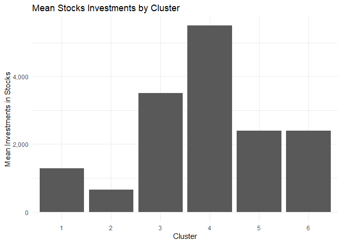<!-- -->

At this point, we can draw the following conclusions: Cluster 1 has an
average mortgage of \$300k, but the other three indicators are low.
Cluster 2 has a great average monthly credit expense of \$2,500, while
all other characteristics are in last place. Cluster 4 has the largest
credit expense, but also the highest investment in stocks. Customers in
cluster 5 have relatively steep monthly expenses than the other five
clusters (\$3,500). Cluster number 6 pays the highest mortgage of around
\$400k, but their other expenses are medium compared to the other
segments. Cluster 3 is the most balanced, with rising investments.
(\$3,500). \### App Logins

``` r
ggplot(data = clust_data, aes(x = factor(Clusters), y = AppLogins)) +
  geom_boxplot() +
  labs(x = "Clusters", y = "App Logins", title = "Boxplot of App Logins by Cluster") +
  theme_minimal()
```

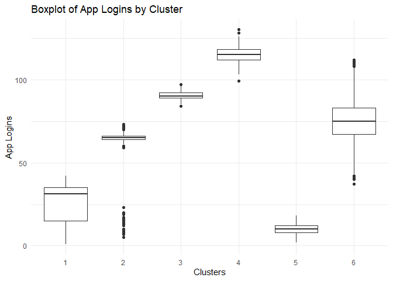<!-- -->

``` r
ggplot(data = clust_data, aes(x = factor(Clusters), y = TimeOnlineBanking)) +
  geom_boxplot() +
  labs(x = "Clusters", y = "Time Spent in Online Banking (Min)", title = "Boxplot of Time Spent Online by Cluster") +
  theme_minimal()
```

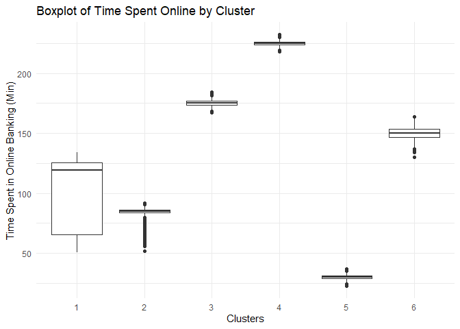<!-- -->

``` r
ggplot(data = clust_data, aes(x = factor(Clusters), y = Bitcoins)) +
  geom_boxplot() +
  labs(x = "Clusters", y = "Bitcoins", title = "Boxplot of Bitcoins Ownership by Cluster") +
  theme_minimal()
```

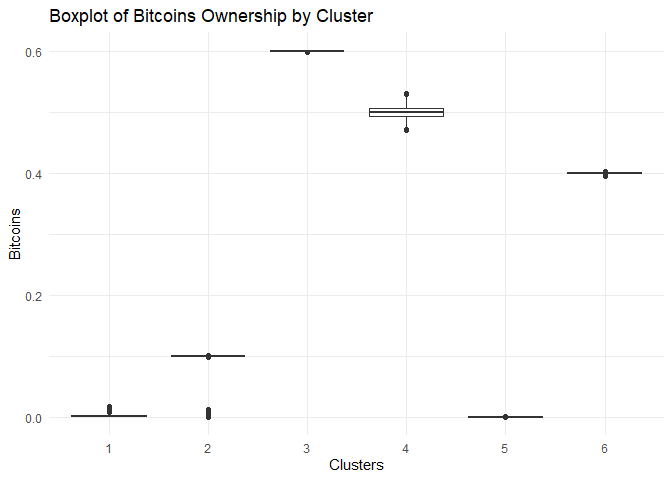<!-- -->

``` r
ggplot(data = clust_data, aes(x = factor(Clusters), y = NFTs)) +
  geom_boxplot() +
  labs(x = "Clusters", y = "NFTs", title = "Boxplot of NFTs Ownership by Cluster") +
  theme_minimal()
```

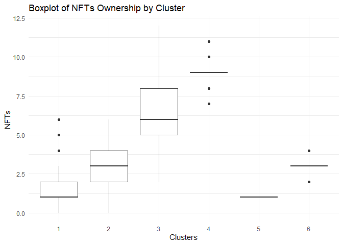<!-- -->

``` r
ggplot(data = clust_data, aes(x = factor(Clusters), y = SocialMediaInter)) +
  geom_boxplot() +
  labs(x = "Clusters", y = "Social Media Channels followed", title = "Boxplot of Followed Financial Social Media Channels by Cluster") +
  theme_minimal()
```

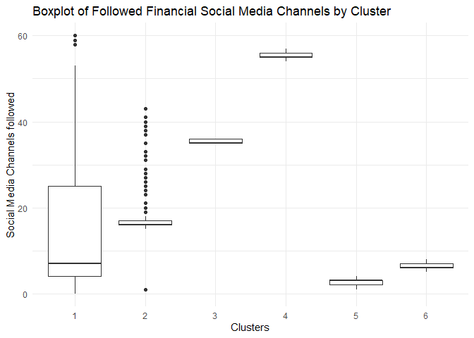<!-- -->

### Branch/office visitations

``` r
ggplot(data = clust_data, aes(x = factor(Clusters), y = BranchVisits)) +
  geom_boxplot() +
  labs(x = "Clusters", y = "Branch Visits", title = "Boxplot of Branch visits by Cluster") +
  theme_minimal()
```

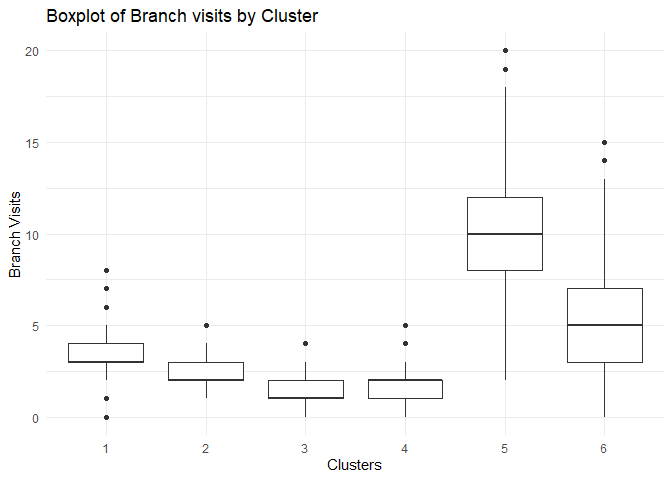<!-- -->

At this stage, we can draw the following conclusions: Cluster 5, which
racks up the highest monthly expenses, actually has the fewest virtual
assets and doesn’t really spend time on online banking. Cluster 4, on
the other hand, is definitely more risky in terms of loans and
investments, but this group is also diving into digital assets, holding
around 0.5 Bitcoins and in some cases more than 10 NFTs. They also spend
the most time in online banking and following finance-related social
media channels.

Cluster 3 looks quite similar to Cluster 4, just one step lower on
almost every factor—except Bitcoin ownership, where they actually rank
at the top. Clusters 1 and 2 show a solid interest in the fintech space,
as we see more clients in these groups following social media finance
channels than the cluster average. They spend a decent amount of time on
online banking, but they’re way more cautious when it comes to investing
in things like Bitcoin and NFTs. Finally, Cluster 6 is heavy on online
banking, invests in Bitcoin, but tends to follow smaller, more niche
finance channels.

When it comes to visiting the bank in person, Clusters 1, 2, 3, and 4
rarely go to branches, while Cluster 5 shows up pretty often (10 times
over the past 8 weeks). Cluster 6 also pops in about 2–3 times a month.

Based on this breakdown, I’d aim to build targeted marketing campaigns
for Clusters 3, 4, 1, and 6. That’s because 3, 4, and 6 are clearly into
online services, while Cluster 1 is massive—covering 30% of the whole
dataset. To get a better understanding of all these groups, we’ll also
take a closer look at their socio-demographic traits.

## Analysis of mean values of socio-demographic factors

### Age

``` r
ggplot(data = clust_data, aes(x = factor(Clusters), y = Age)) +
  geom_boxplot() +
  labs(x = "Clusters", y = "Age", title = "Boxplot of Age by Cluster") +
  theme_minimal()
```

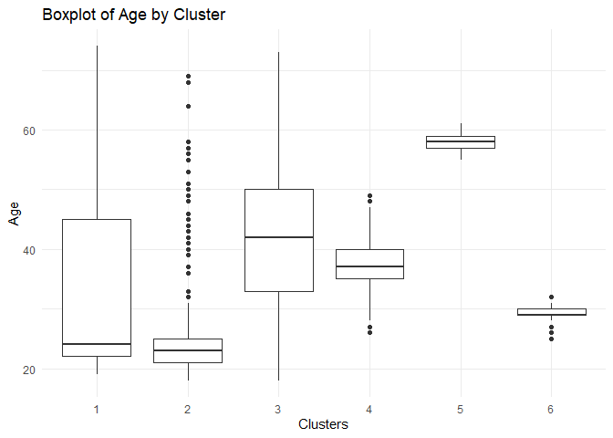<!-- -->

Starting with the age of our customers, it becomes clear that customers
in cluster number 5 are older, with an average age of almost 60.
Clusters 3 and 4 have an average age of around 40, but in cluster 3 we
have customers who are close to the maximum and minimum ages, i.e. high
dispersion. The interesting thing about the largest cluster, cluster 1,
is that we have an average age of 25, which is low compared to the
others. 50% of cluster 1 are under 45 years of age. Cluster 2 consists
mainly of young consumers with some exceptions, and cluster 6 has an
average age of 30.

### Income

``` r
ggplot(data = clust_summary, aes(x = factor(Clusters), y = clust_summary$Income_mean)) +
  geom_bar(stat = "identity") +
  scale_y_continuous(labels = scales::comma)+
  labs(x = "Cluster", y = "Mean Income") +
  ggtitle("Mean Income by Cluster")+
  theme_minimal()
```

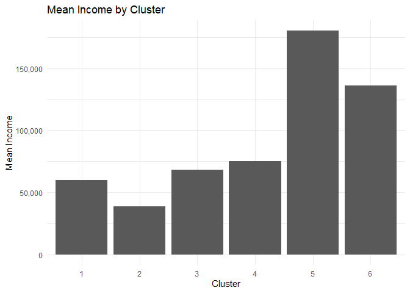<!-- -->

<!-- -->
If we examine the monthly income of the clusters obtained, we can see
that clusters 1, 3, and 4 are very close (\$75k). Cluster 5 has the
highest average income of \$175k, which leads to a positive linear
correlation with the age of customers in this cluster and justifies
their high monthly expenses. In second place is cluster 6, which is one
of the segments with younger customers who spend time online.

### Household size

``` r
ggplot(data = clust_data, aes(x = factor(Clusters), y = HouseholdSize)) +
  geom_boxplot() +
  labs(x = "Clusters", y = "HouseholdSize", title = "Boxplot of Household Size by Cluster") +
  theme_minimal()
```

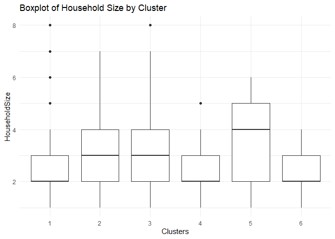<!-- -->

Since segments 1, 3, 4, and 6 consist mainly of young customers, we can
see that they mostly live with their partner without children or, most
often, with one child.

### Internet traffic

``` r
ggplot(data = clust_summary, aes(x = factor(Clusters), y = clust_summary$InternetTrafficVolume_mean)) +
  geom_bar(stat = "identity") +
  scale_y_continuous(labels = scales::comma)+
  labs(x = "Cluster", y = "Mean Internet traffic") +
  ggtitle("Mean Internet traffic by Cluster")+
  theme_minimal()
```

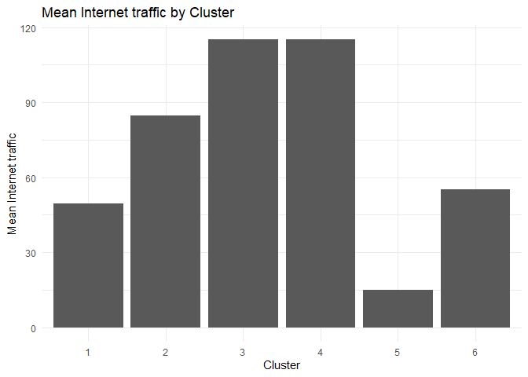<!-- -->

<!-- -->
Clusters 3 and 4, which we knew spent a relatively large amount of time
banking online and followed quite a few fintech channels on social
media, can be seen to have high overall internet traffic. Our older
customers do not spend time online and are not suitable for our
campaign, while clusters 1 and 6 have a stable average Internet traffic
of 50 GB.

# Customer Personas

#### As table:

``` r
personas <- data.frame(
  Persona = c("Risky Investor", 
              "Innovative Investor", 
              "Established & Open", 
              "Young Professional", 
              "The Indebted", 
              "Mature Traditionalist"),
  Cluster = c(4, 3, 6, 1, 2, 5),
  Age_Median = c(38, 42, 29, 25, 23, 58),
  Income_Median = c(75000, 70000, 130000, 60000, 40000, 175000),
  Household_Size = c("With partner (2)", 
                     "Partner + 1 child (3)", 
                     "Partner + child (3)", 
                     "With partner (2)", 
                     "Partner + child (3)", 
                     "Partner + 2 children (4)"),
  Behaviour = c("High-risk profile due to loans and investments. Prefers Bitcoins/NFTs. Very high online activity.",
                "Active online, follows social channels. Owns Bitcoins/NFTs. Balanced loans/expenses vs. investments.",
                "High mortgage, medium investment value. Good online banking activity. Owns Bitcoins.",
                "Moderate online activity and interest in fintech. Low spending/loans, but relatively high mortgage. Low interest in digital assets.",
                "High loans, low investments. Moderate-to-low online activity. Financial instability.",
                "Very low online activity. High income but also high monthly expenses. Weak asset investing."),
  Potential = c("High", "High", "Medium–High", "Medium", "Low", "Very Low"),
  Comments = c("Early adopters. 1,250 clients.",
               "Tech-advanced group. Lower risk than Cluster 4. 1,000 clients.",
               "Needs education on WalletUp benefits. High potential for investing in WalletUp. 1,500 clients.",
               "Large 'middle-class' base. Could be marketed app benefits beyond digital assets. 2,959 clients (largest group).",
               "No interest in investing. 2,541 clients. Not a priority.",
               "Conservative, older clients. Prefers traditional banking. 1,500 clients.")
)

knitr::kable(personas, caption = "Customer Personas", format = "markdown")
```

| Persona | Cluster | Age_Median | Income_Median | Household_Size | Behaviour | Potential | Comments |
|:---|---:|---:|---:|:---|:---|:---|:---|
| Risky Investor | 4 | 38 | 75000 | With partner (2) | High-risk profile due to loans and investments. Prefers Bitcoins/NFTs. Very high online activity. | High | Early adopters. 1,250 clients. |
| Innovative Investor | 3 | 42 | 70000 | Partner + 1 child (3) | Active online, follows social channels. Owns Bitcoins/NFTs. Balanced loans/expenses vs. investments. | High | Tech-advanced group. Lower risk than Cluster 4. 1,000 clients. |
| Established & Open | 6 | 29 | 130000 | Partner + child (3) | High mortgage, medium investment value. Good online banking activity. Owns Bitcoins. | Medium–High | Needs education on WalletUp benefits. High potential for investing in WalletUp. 1,500 clients. |
| Young Professional | 1 | 25 | 60000 | With partner (2) | Moderate online activity and interest in fintech. Low spending/loans, but relatively high mortgage. Low interest in digital assets. | Medium | Large ‘middle-class’ base. Could be marketed app benefits beyond digital assets. 2,959 clients (largest group). |
| The Indebted | 2 | 23 | 40000 | Partner + child (3) | High loans, low investments. Moderate-to-low online activity. Financial instability. | Low | No interest in investing. 2,541 clients. Not a priority. |
| Mature Traditionalist | 5 | 58 | 175000 | Partner + 2 children (4) | Very low online activity. High income but also high monthly expenses. Weak asset investing. | Very Low | Conservative, older clients. Prefers traditional banking. 1,500 clients. |

Customer Personas

# Conclusion

## Marketing strategy

After running a detailed cluster analysis, my first recommendation is to
focus on the “Risky Investor” and the “Innovative Investor.” These two
groups spend the most time online and would adapt quickly to using the
app. The Risky Investor, in particular, makes bold financial moves and
is more likely to experiment with new investment methods, making them an
ideal early adopter.

The Established & Open group (Cluster 6) also shows strong potential.
They’re active online but currently focus more on real estate through
mortgages. With the right guidance and education, this segment could be
encouraged to diversify. Their higher average income also makes them a
valuable and profitable target. At the same time, seeing peers from
Clusters 3 and 4 adopt the app could motivate them to take action.

The Young Professionals represent the largest customer base. They have a
decent online presence, and with the right campaign, WalletUp could draw
them in by showing different investment opportunities beyond just
traditional assets. Their large numbers open the door for testing and
scaling multiple marketing strategies.

On the other hand, the Indebted group isn’t a good fit right now—they’re
financially unstable and less engaged online compared to the other
clusters.

Lastly, the Mature Traditionalists are high-income earners but older and
less digitally active. They prefer visiting branches in person. While
most campaigns should be digital (especially via social media), this
group is best approached offline through branch staff interactions or
printed materials like flyers.
